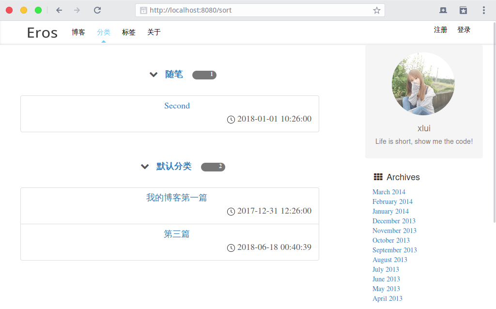
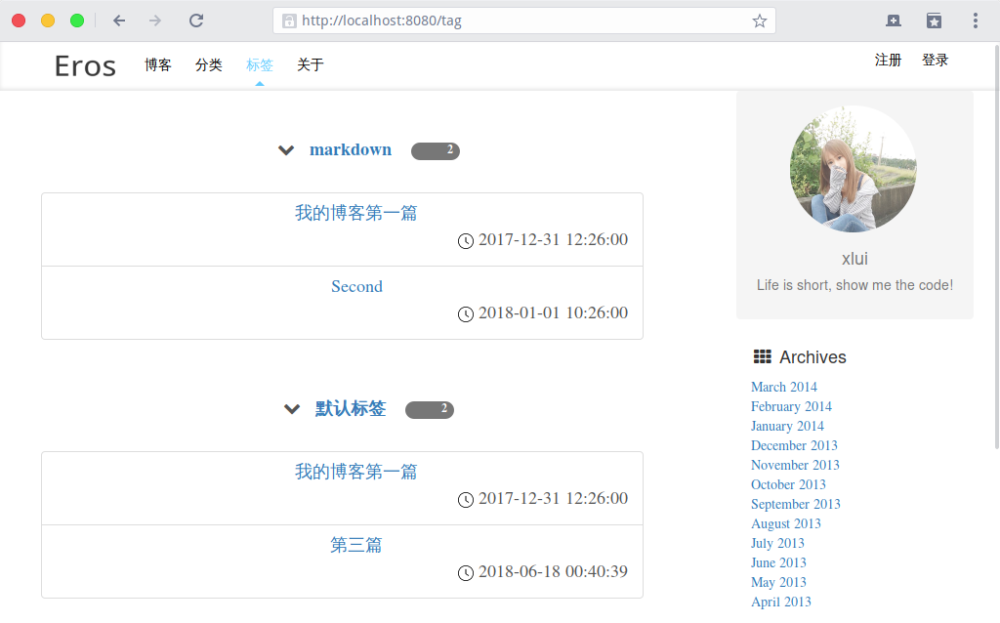
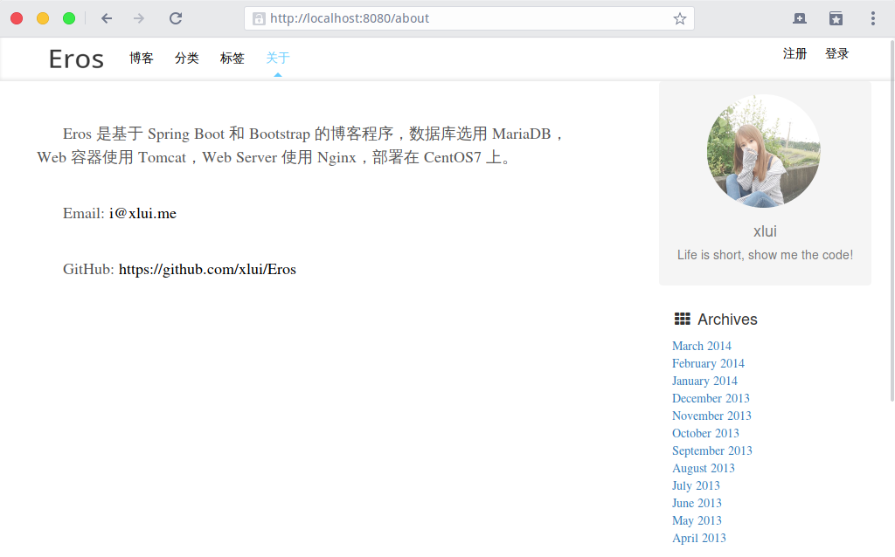

# Eros

This is a simple blog based on spring boot, spring mvc and mybatis. The reason of choosing mybatis instead of spring data jpa is that mybatis provides a fine-grained control of our database. We can customize our SQL statement, and doing this in spring data jpa is a little of difficult.

This blog is a simple blog includes user & comment system, visitors can register, comment. Just this.

The relationship graph of database:

Next is a preview of this project.

## Index

## Article

## Sort

## Tag

## Login

## About

