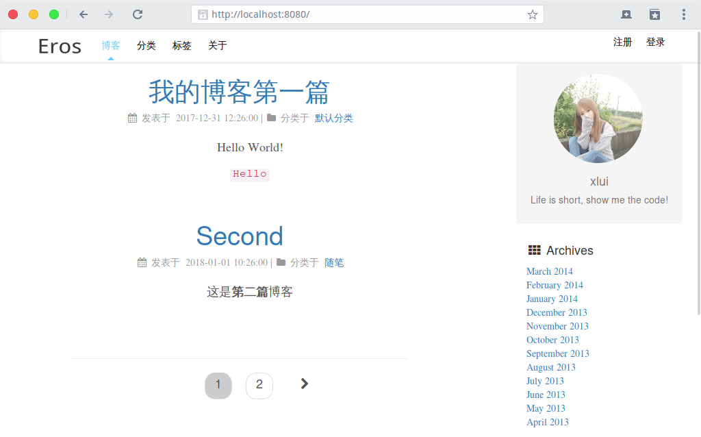
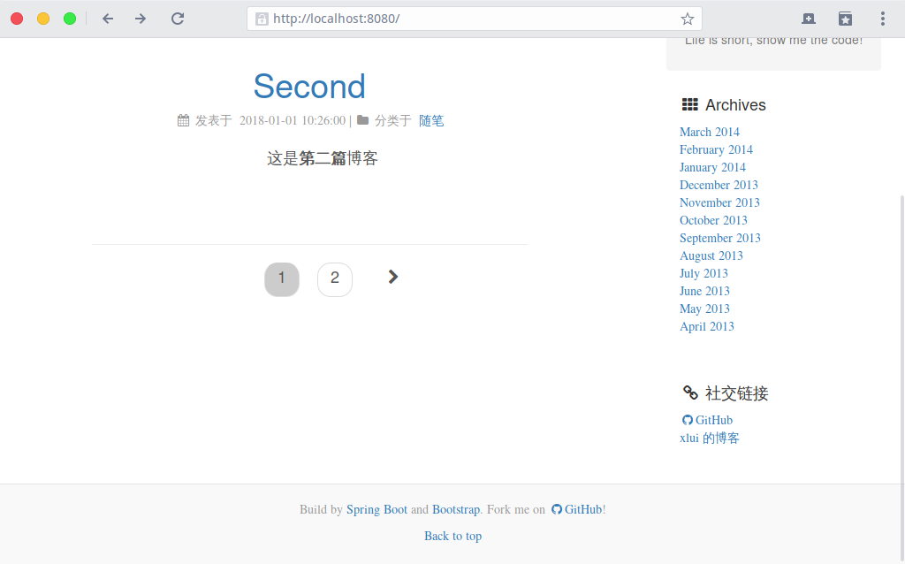
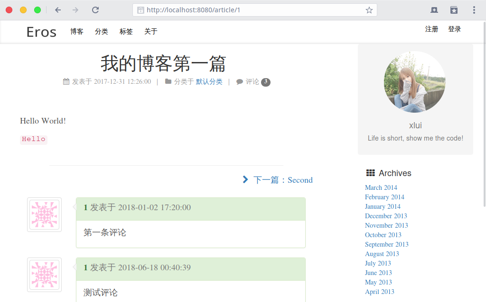
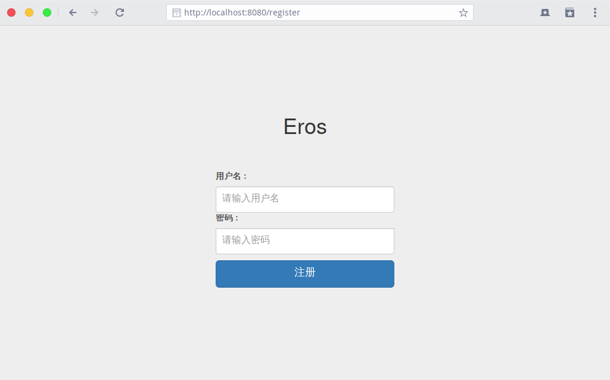

# Eros

Spring-Boot based blog Eros. 

[中文](README_zh.md)

Develop with Intellij IDEA, spring boot 1.5.8.RELEASE, mariadb 10.1.29.

Use Template Engine `Thymeleaf`, and `Spring Data JPA` for data access operations. And `Bootstrap` for front page.

## Demand Analysis

1. Database tables: article, sort, tag, user, access, comment

2. Pages: index, sort, tag, about, login

> index: show article preview in time desc, loog articles should be shorten in proper words.
>
> sort: show sorts and the count of articles each sort have
>
> tag: show tags and the cound of tags
>
> about: about the author
>
> login: register, login, change password

## Preview

Index:

Sorts:

Tags:

Articles:

Login:

## LICENSE

MIT
