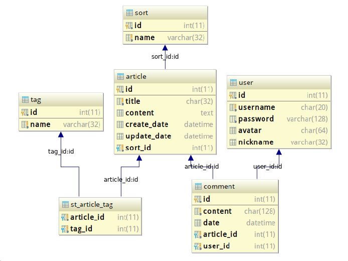

# Eros

基于 Spring Boot 开发的博客程序 Eros

使用 Intellij IDEA 开发，Spring Boot 版本 1.5.8.RELEASE，Mariadb 版本 10.1.29

使用 thymeleaf 做模板引擎，持久层使用 Spring Data JPA，前端使用 Bootstrap

## 需求分析

1、数据库表：文章、分类、标签、用户、评论

2、具体页面：首页、分类页、标签页、关于页、登录页
 
> 首页：按时间倒序显示文章列表，文章适当缩短字数
>
> 分类页：显示不同分类并显示数量
>
> 标签页：显示标签以及数量
>
> 关于页：关于作者
>
> 登录页：用户注册、用户登录、用户修改密码。

## 预览

首页：

分类：

标签：

文章：

登录：

## LICENSE

MIT
